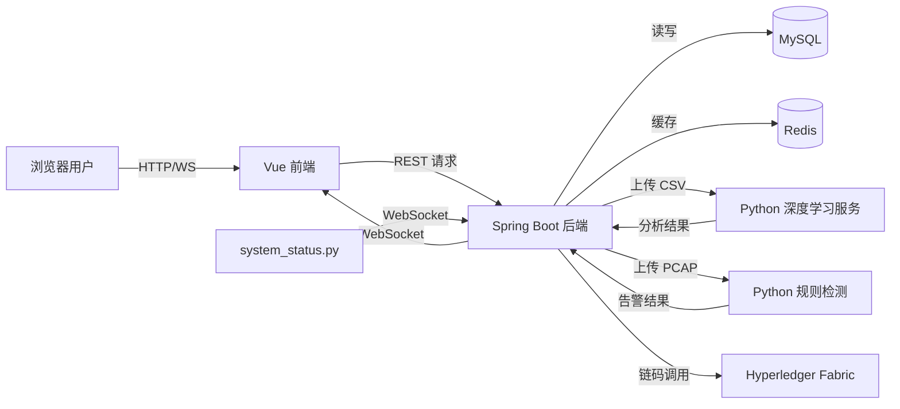

网络安全平台由三个大块组成：前端可视化、Java 后端、Python 入侵检测服务，再加上 MySQL、Redis 与 Hyperledger Fabric 等外部支撑。下面按非技术视角说明各组件的作用与协作方式。

## 主要组成
- **前端（`frontend`）**  
  基于 Vue 2 与 DataV 组件库。负责展示流量指标、攻击类型、主机健康度，调用后端开放的 REST 接口，同时通过 WebSocket 获得实时更新。
- **后端（`backend/back`）**  
  Spring Boot 3 项目，串联数据库、Redis、区块链与 Python 服务：  
  - `controller` 暴露 REST API 与 WebSocket。  
  - `service`/`mapper` 负责 MySQL 与 Redis 的读写。  
  - `FileUploadController` 将上传的 CSV/PCAP 转发给 Python 推理服务。  
  - `BlockChainController` 借助 `GatewayConfig` 调用 Hyperledger Fabric。  
  - `WebSocket` 组件把 Python 发送的系统指标写入 Redis，再广播给前端。
- **入侵检测服务（`ids-services`）**  
  - `ids-services/ids/ids.py`：提供 `/upload` 接口，解析 PCAP 并基于文本规则库识别风险。  
  - `ids-services/ids/system_status.py`：采集主机 CPU/内存/磁盘/网络，定时通过 WebSocket 推送给后端。  
  - `ids-services/EC-GAN_NIDS-main/mymodel/code/api/nids_flask.py`：加载深度学习模型，对 CSV 流量进行类别识别，返回每条记录的攻击类型与置信度。  
  - `ids-services/EC-GAN_NIDS-main/mymodel/code/api/nids_flask_critic.py`：在上一次服务基础上增加“未知攻击”评估。  
  每个 Python 服务都以 Flask（或 Flask-SocketIO）形式单独运行。
- **外部依赖**  
  - MySQL：保存 `my_flow`、`rule` 等核心表，存储历史记录与规则定义。  
  - Redis：缓存最近一次流量分析的结果、系统状态、CSV 统计数据供前端秒级刷新。  
  - Hyperledger Fabric：通过链码 `MyAssetChaincode` 保存已经确认的规则与关键流量，实现不可篡改的记录。

## 数据与调用流
- 用户在网页上传 CSV/PCAP 文件 → 后端保存临时文件 → 调用相应的 Python 服务 → Python 返回分析结果 → 后端写入 MySQL 与 Redis → 前端刷新页面显示。  
- Python `system_status.py` 每隔数秒推送主机健康度 → 后端 WebSocket 服务接收并写入 Redis → 前端通过 WebSocket 收到即时状态。  
- 安全人员在网页维护规则 → 后端通过 MyBatis-Plus 写入 MySQL → 若选择“上链”，后端调用 Hyperledger Fabric 网关，把规则持久化到区块链。  
- 前端所有统计图表通过 REST 接口读取 Redis 或 MySQL 聚合后的数据。

- **配置文件**：`backend/back/src/main/resources/application.yaml` 定义数据库、Redis、区块链证书路径、Python 服务的文件存储位置（需按部署环境改写）。  
- **证书与钱包**：`backend/back/src/main/resources/crypto-config`、`backend/back/wallet/` 存放 Fabric 使用的证书，需要与实际网络完全匹配。  
- **模型文件**：`ids-services/EC-GAN_NIDS-main/mymodel/models/*.h5` 与 `ids-services/EC-GAN_NIDS-main/mymodel/pretreatment-model/*.pkl` 体积较大，必须放在 Python 服务可读取的位置。  
- **规则库**：`ids-services/ids/protocol`、`ids-services/ids/warning`、`ids-services/ids/rules` 等文本文件是规则检测的知识库，更新时务必同步。  
- **网络连通性**：后端默认调用局域网地址（例如 `http://192.168.*`），部署时需统一调整各自的 IP 或改为环境变量。
